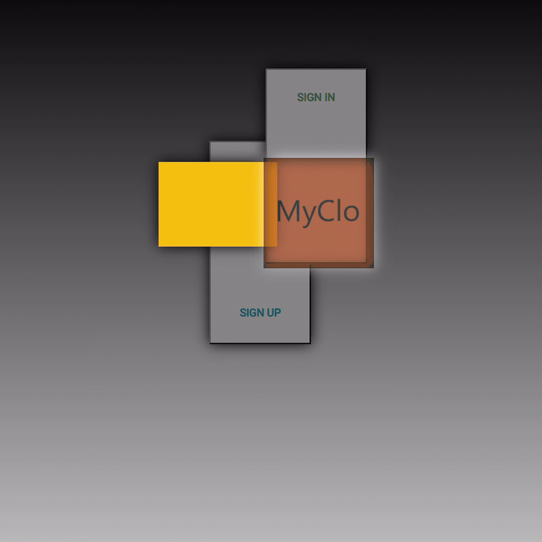
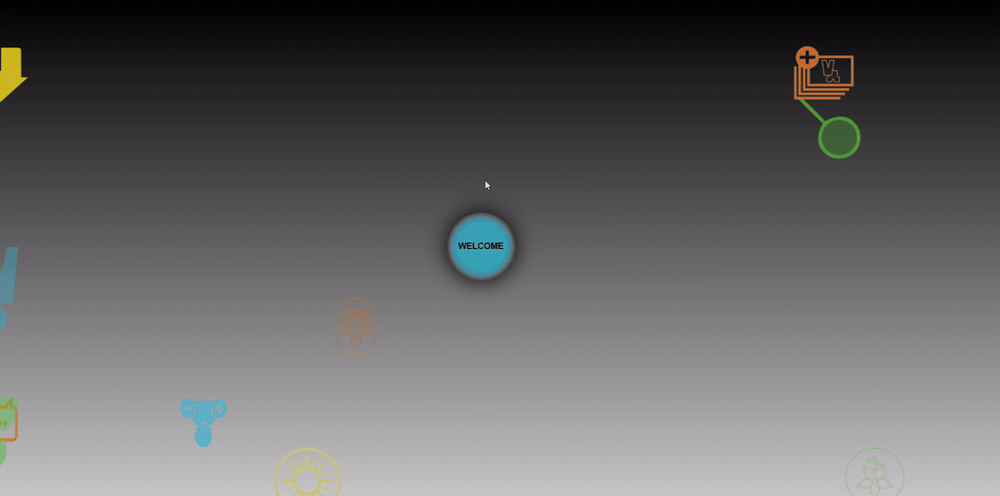
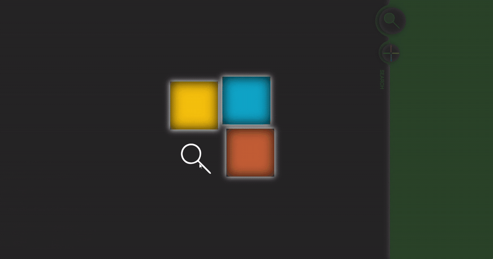

# MyClo — Final Front-end Course Project

**Experimental UI & Animation · Final course project · Grade: 16/20**

MyClo is an experimental interface created as my final Front-end Development course project.

I used the project to explore motion, transitions, transformations and animated UI states, bringing together my previous visual-design background with the front-end skills I was developing at the time.

This project was completed shortly before I started my first professional front-end role at VisionWare.

## Motion & Interaction

The project was designed as a sequence of animated interface states. Each stage explores a different aspect of motion, transformation and interaction.

### 01 — Sign Up Flow

  

Sign Up selection → block transformation → form reveal.

### 02 — Welcome Motion

Welcome transition → animated icons → rotation and colour changes.

### 03 — Menu Interactions

Main menu → hover states → animated panel interactions.

## Exploring Design Through Motion

MyClo was an experiment in making movement and composition part of the interface experience. I explored:

- CSS animations and transitions
- Transforms, rotation and movement
- Colour changes and animated interface states
- JavaScript-triggered interactions
- Custom iconography

The focus was on how visual elements could move, transform and reveal the next state of the interface.

## Interface Journey

Entry → Sign In / Sign Up → Form → Welcome → Main Menu

This visual and interactive prototype connects an animated entry screen with demonstrative forms, a Welcome state and a main menu with Home, User, Search and Chat areas.

## What I Practised

- Translating visual concepts into HTML/CSS
- CSS animations and transitions
- Transformations and positioning
- JavaScript DOM interaction
- Visual state changes
- Interface composition
- Custom icon integration
- Connecting design decisions with front-end implementation

The central learning experience was translating my visual sensibility into code and interactive behaviour.

## Built With

HTML5 · CSS · JavaScript

The project also uses HTML5 Boilerplate, Normalize.css and Modernizr as part of its original technical foundation.

## Project Scope

MyClo was created as an academic experimental prototype focused on interface design, animation and interaction.

The Sign In / Sign Up forms are demonstrative and do not implement authentication, account creation or backend functionality.

Some menu areas represent visual interaction concepts rather than completed product features.

## From Learning to Professional Work

This project represents the final stage of my Front-end Development training before entering my first professional front-end role.

It captures an early point in my transition from a long-standing visual-design background into interface implementation — a connection between design and development that continues to define the way I work today.

Current portfolio: [Atlyon](https://atlyon.pt)

## Author

**Joana Castro**

UI/UX Designer & Front-end Developer

- [Current Portfolio](https://atlyon.pt)
- [LinkedIn](https://www.linkedin.com/in/joanadecastro/)
- [GitHub](https://github.com/joanadecastro)
